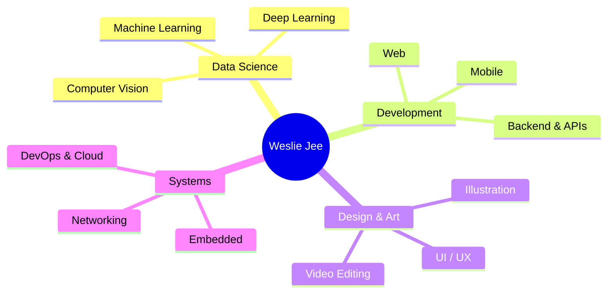

<!-- ═══════════════════════════════════════════════════════════════════════════
     WESLIE JEE  —  GITHUB PROFILE README
     Username used below: Weslie23  (from your git remote)
     >>> If your GitHub username is different, Find & Replace "Weslie23" everywhere. <<<
     Repo to paste this into:  github.com/<username>/<username>  (repo name = your username)
═══════════════════════════════════════════════════════════════════════════ -->

<!-- ─────────────────────────────  HEADER  ───────────────────────────── -->

<div align="center">


<br/>


</div>

<!-- ─────────────────────────  WHITE DEATH ART  ─────────────────────────
     Layout: two GIFs side by side on top, one below.
     All files live in assets/ — swap any filename to change a slot. -->

<div align="center">
  
  &nbsp;&nbsp;
  
  <br/>
  
  <br/>
  <sub><i>❄️ The White Death — Simo Häyhä · Record of Ragnarok</i></sub>
</div>

<!-- ─────────────────────────────  ABOUT  ───────────────────────────── -->

## 🧑‍💻 About Me

I am **Weslie Jee**, a **Data Science specialist** who genuinely loves what I do — especially **designing and drawing**. I'm a **Computer Engineering** graduate with experience in Computer Networking, Network Automation & Deployment, Web & Mobile-based Application Development, and programming Embedded & Microprocessor Systems (Arduino, Raspberry Pi).

- 💼 &nbsp;I'm mainly a **Full-Stack Developer** for a real-estate company — I build & run the **CRM website**, and being into data science I handle pretty much everything, **especially the automations**.
- 📊 &nbsp;My focus is **Data Science** — computer vision, machine learning, and deep learning.
- 🎨 &nbsp;Outside the code, I'm a **designer & artist** — illustration, editing, and visual design are my thing.
- ⚛️ &nbsp;Explored a bit of **quantum computing** during my 3rd year in college.

## 🚀 Featured Work

- 🏡 **[Official Integrity Realty](https://official.integrityrealty.ph)** — a real-estate **CRM & property platform**. Originally WordPress + WP Residence + Elementor + Squarespace (PHP); I rebuilt it with **Astro**.
- 🌐 **[Integrity Realty](https://integrityrealty.ph)** — the main company website.
- 🌆 **[Philippine Properties](https://philippine-properties.com/)** — original maker of the platform (built together with a colleague).

<!-- ─────────────────────────  MERMAID MINDMAP  ─────────────────────────
     GitHub renders ```mermaid blocks natively — this draws itself. Very few
     profiles do this, so it stands out. Edit the branches to taste. -->

## 🗺️ What I Do — at a glance



<!-- ─────────────────────────────  SOCIALS  ───────────────────────────── -->

## 🌐 Connect With Me

<p align="left">
  <a href="mailto:wesliejee@gmail.com"></a>
  <!-- Add these once you have the links, then uncomment:
  <a href="https://linkedin.com/in/YOUR_LINKEDIN"></a>
  <a href="https://YOUR_PORTFOLIO.com"></a>
  -->
</p>

<!-- ═════════════════════════════  TECH STACK  ═════════════════════════════ -->

## 🧠 Languages


## 🎨 Frontend & Mobile


## ⚙️ Backend & Frameworks


## 🗄️ Databases & Backend-as-a-Service


## 📊 Data Science · ML · AI  &nbsp;`⭐ my specialty`


<sub>🔬 Fields: **Computer Vision · Machine Learning · Deep Learning**</sub>

## ☁️ DevOps, Cloud & Automation


## 🔌 Embedded, Hardware & CAD


## 🐧 OS, Linux & Virtualization


## 🛡️ Networking & Security


## 💻 IDEs & AI Coding Stack


## 🤖 AI & LLM Toolbox


## 🖌️ Design & Illustration Stack


## 🎬 Video & Editing Stack


## 📄 Docs & Productivity Stack


## 📈 Finance & Trading


## 🎮 Gaming & Launchers


## 🧰 Utilities


<!-- ═════════════════════════════  GITHUB STATS  ═════════════════════════════ -->

## 📊 GitHub Stats

<div align="center">


<br/>


</div>

## 🏆 GitHub Trophies

<div align="center">

</div>

---

<div align="center">
  <i>🎨 Data by day, art by heart — Weslie Jee.</i>
</div>